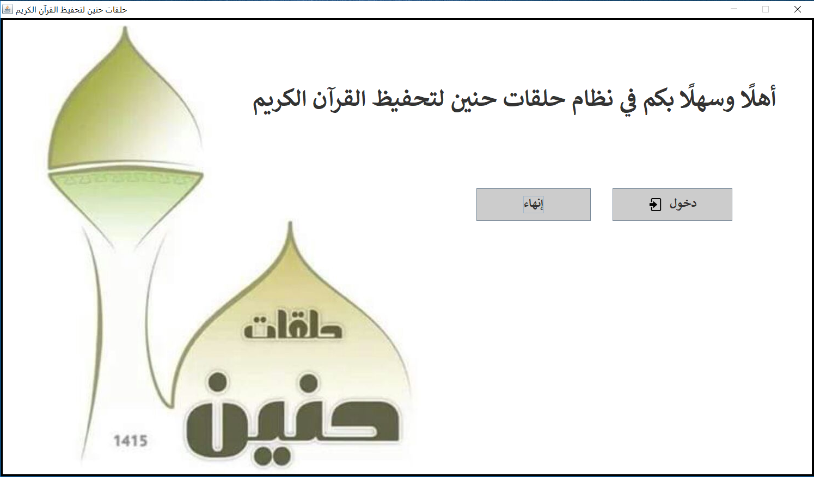

# Halaqat-Honien
 Desktop application for Halaqat Honien to manage their students &amp; teachers with MySql database

It's Java based program intended for Halaqat Honien management system. 
It's allow easily management for all students and teachers in Halaqat Honien.

<h5># My program can be used by a teacher or by manager</h5>

<h5># As a Teacher, you can :</h5>
- Add new student. 
- Update student information. 
- Remove student. 
- Retrieve a removed student from the removed students archive. 
- Show all students with ability to filter the all students based on their level.

<h5># As Manager, you can :</h5>
- Do what the teacher can do exactly. 
--> plus: 
    - Add new teacher. 
    - Update teacher information. 
    - Delete teacher. 
    - Retrieve a removed teacher from romoved teachers archive. 
    
<h5>Note : retrieving after removing was one of the Halaqat Honien requirements.</h5>

Screenshot for the main page of the program

